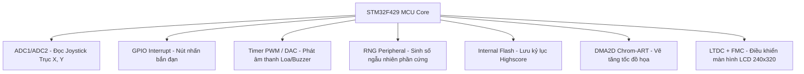

# Tài liệu Thiết kế Game Bắn Gà (Chicken Invaders) - STM32F429 Discovery

Tài liệu này đặc tả chi tiết thiết kế hệ thống, cơ chế gameplay, thông số kỹ thuật đồ họa và cấu hình phần cứng cho dự án game bắn gà chạy trên kit STM32F429 Discovery.

---

## 🖥️ 1. Thông số Kỹ thuật Màn hình & Hệ Tọa độ

### 1.1. Cấu hình LCD
- **Thiết bị**: Màn hình LCD tích hợp trên kit STM32F429I-DISCO.
- **Hướng màn hình**: Màn hình đứng (Portrait Mode).
- **Độ phân giải**: $240 \times 320$ pixels.
  - Trục $X$: Chiều ngang từ $0$ (bên trái) đến $239$ (bên phải).
  - Trục $Y$: Chiều dọc từ $0$ (phía trên) đến $319$ (phía dưới).

### 1.2. Neo Tọa độ (Anchor Point)
Để tối ưu hóa hiệu năng vẽ của thư viện đồ họa STM32 BSP và bộ tăng tốc **DMA2D**, hệ thống thống nhất sử dụng **Neo góc trên - bên trái (Top-Left)** làm gốc tọa độ cho tất cả các đối tượng vẽ trên màn hình.

```
(X, Y) ──►  ┌────────────────────────┐
            │       Width (W)        │
            │                        │ Height (H)
            │                        │
            └────────────────────────┘
```

### 1.3. Kích thước Thực tế của Sprites (Đề xuất)
| Thực thể | Sprite Width ($W$) | Sprite Height ($H$) | Mô tả |
| :--- | :---: | :---: | :--- |
| **Phi thuyền (Player)** | 24 px | 24 px | Tàu vũ trụ ở đáy màn hình. |
| **Gà thường (Chicken)** | 16 px | 16 px | Đàn gà di chuyển phía trên. |
| **Gà Boss (Boss)** | 48 px | 48 px | Xuất hiện ở các màn đặc biệt. |
| **Viên đạn (Bullet)** | 4 px | 8 px | Bay từ phi thuyền hướng lên trên. |
| **Trứng gà (Egg)** | 8 px | 8 px | Do gà thả xuống hướng về phi thuyền. |

---

## 🎮 2. Cơ chế Gameplay & Logic

### 2.1. Điều khiển
- **Di chuyển**: Sử dụng **Joystick** kết nối qua 2 kênh ADC (trục X và Y). Phi thuyền có thể di chuyển 4 hướng (Lên, Xuống, Trái, Phải) giới hạn trong khung hình:
  - $0 \le X_{player} \le 240 - W_{player}$
  - $160 \le Y_{player} \le 320 - H_{player}$ (Giới hạn phi thuyền chỉ ở nửa dưới màn hình).
- **Bắn đạn**: Nhấn nút bấm vật lý (nút USER màu xanh trên kit hoặc nút rời) để bắn đạn thẳng lên trên với tốc độ cố định.

### 2.2. Hệ thống màn chơi khó dần (Level & Waves)
Game được chia thành các màn chơi (Levels), mỗi level gồm nhiều đợt tấn công (Waves). Độ khó tăng tiến thông qua:
1. **Số lượng gà**: Tăng số lượng gà xuất hiện đồng thời trên màn hình.
2. **Tốc độ di chuyển**: Đàn gà di chuyển ngang và tịnh tiến xuống dưới nhanh hơn.
3. **Tần suất thả trứng**: Gà thả trứng nhiều hơn và với tốc độ rơi nhanh hơn.
4. **Mẫu di chuyển (Movement Patterns)**:
   - *Màn 1*: Gà đứng yên hoặc di chuyển ngang đơn giản.
   - *Màn 2*: Gà di chuyển theo hình sóng Sin hoặc Zigzag.
   - *Màn 3*: Xuất hiện Gà Boss có lượng máu lớn và bắn trứng tản ra nhiều hướng.

### 2.3. Sinh số Ngẫu nhiên Phần cứng (STM32 Hardware RNG)
Thay vì sử dụng thuật toán giả ngẫu nhiên phần mềm (`rand()`) dễ bị trùng lặp chu kỳ, game sẽ kích hoạt ngoại vi **RNG (Random Number Generator)** có sẵn trên chip STM32F429 để tạo ra các biến động ngẫu nhiên thực sự:
- **Tọa độ xuất hiện của gà**: Xác định vị trí hồi sinh của gà ngoài biên.
- **Thời gian thả trứng**: Sử dụng RNG để tạo khoảng trễ ngẫu nhiên giữa các lần thả trứng của từng con gà.
- **Tốc độ rơi của trứng**: Một số quả trứng sẽ rơi nhanh hơn hoặc bay chéo ngẫu nhiên.
- **Góc bắn của Boss**: Boss bắn đạn tản góc ngẫu nhiên.

```c
// Hàm cấu hình và lấy số ngẫu nhiên từ phần cứng RNG STM32
uint32_t Get_Hardware_Random(uint32_t min, uint32_t max) {
    uint32_t random_val = 0;
    // Đọc thanh ghi RNG->DR sau khi phần cứng sinh xong số ngẫu nhiên
    HAL_RNG_GenerateRandomNumber(&hrng, &random_val);
    return (random_val % (max - min + 1)) + min;
}
```

### 2.4. Hệ thống Điểm số & Kỷ lục (Score & Highscore)
- **Điểm số (Score)**: Tăng khi bắn trúng gà thường (+10 điểm) hoặc gà Boss (+100 điểm).
- **Mạng sống (Lives)**: Người chơi có 3 mạng. Va chạm với gà hoặc trứng sẽ trừ 1 mạng. Về 0 mạng sẽ chuyển sang màn hình Game Over.
- **Highscore (Điểm cao kỷ lục)**:
  - Điểm số cao nhất sẽ được lưu trữ vào bộ nhớ **Flash nội bộ của STM32** (Sử dụng một Sector trống ở cuối bộ nhớ Flash, ví dụ Sector 11 hoặc Sector 23 tùy chip để tránh đè lên code).
  - Khi khởi động game, hệ thống đọc dữ liệu từ Sector này để hiển thị Highscore lên màn hình Menu.
  - Khi Game Over, nếu `Score > Highscore`, hệ thống sẽ ghi đè điểm mới vào Flash.

---

## 🔊 3. Thiết kế Hệ thống Âm thanh (Audio System)

Sử dụng còi chíp (Buzzer) hoặc loa nhỏ kết nối với Timer PWM hoặc DAC của STM32. Mỗi sự kiện game sẽ kích hoạt một tần số và thời lượng phát khác nhau:

| Sự kiện | Tần số (Hz) | Thời gian phát (ms) | Mô tả âm thanh |
| :--- | :---: | :---: | :--- |
| **Bắn đạn (Shoot)** | 800 Hz -> 1500 Hz | 80 ms | Tần số quét nhanh từ thấp lên cao (tiếng chíp). |
| **Gà chết (Chicken Die)** | 200 Hz -> 50 Hz | 150 ms | Tần số quét giảm dần (tiếng nổ/xịt). |
| **Thua cuộc (Game Over)** | 400 Hz -> 300 Hz -> 200 Hz | 600 ms | Chuỗi nốt nhạc trầm buồn kéo dài. |

---

## 🛠️ 4. Phân bổ Cấu hình Ngoại vi STM32 (Hardware Resource Map)

Để hệ thống hoạt động trơn tru, các ngoại vi trên vi điều khiển STM32F429 sẽ được cấu hình như sau:



1. **RNG**: Cho phép sinh số ngẫu nhiên không trùng lặp nhằm đa dạng hóa gameplay.
2. **TIM3 / TIM4 (PWM)**: Cấu hình tần số thay đổi để điều khiển loa phát âm thanh.
3. **ADC1 (Channel 0 & 1)**: Đọc giá trị Joystick từ chân PA0 và PA1.
4. **GPIO EXTI Line 0 (PB0 hoặc PA0)**: Cấu hình ngắt sườn xuống cho nút nhấn bắn đạn để phản hồi tức thời.
5. **FMC & LTDC**: Giao tiếp màn hình màu TFT LCD, cấu hình 2 Layer cho Double Buffering.
6. **DMA2D**: Thực hiện copy sprite từ bộ nhớ Flash ra màn hình nhanh chóng mà không làm nghẽn CPU.
7. **FLASH Sector**: Lưu trữ Highscore vĩnh viễn kể cả khi rút nguồn kit.

---

## 📅 5. Kế hoạch Hiện thực và Phối hợp Nhóm

### Giai đoạn 1: Khởi tạo và Giao kèo API (Tuần 1)
- Tạo các file base `input.h`, `audio.h`, `game_engine.h`, `display.h`.
- Người 1 cấu hình phần cứng cơ bản (GPIO, ADC, Timer, RNG) trên STM32CubeIDE.
- Người 2 lập trình khung logic game trên máy tính (sử dụng C compiler thông thường để test logic).
- Người 3 vẽ thử các sprite và chuyển đổi sang mảng Hex.

### Giai đoạn 2: Phát triển Module Độc lập (Tuần 2)
- Người 1: Hoàn thiện đọc Joystick ổn định (chống nhiễu ADC) và phát âm thanh mượt mà.
- Người 2: Hoàn thiện tính va chạm, cơ chế spawn gà ngẫu nhiên bằng RNG, chuyển màn.
- Người 3: Cấu hình Double Buffering trên LCD, tối ưu hóa tốc độ vẽ bằng DMA2D.

### Giai đoạn 3: Ráp nối và Tinh chỉnh (Tuần 3)
- Tích hợp tất cả các module vào file `main.c`.
- Tiến hành chạy thử, cân bằng độ khó của game bằng cách tinh chỉnh các thông số ngẫu nhiên của RNG.
- Thực hiện lưu/đọc Highscore vào Flash STM32.
- Kiểm tra rò rỉ bộ nhớ và tối ưu hóa thời gian trễ của game (FPS ổn định ở mức ~50-60 Hz).
